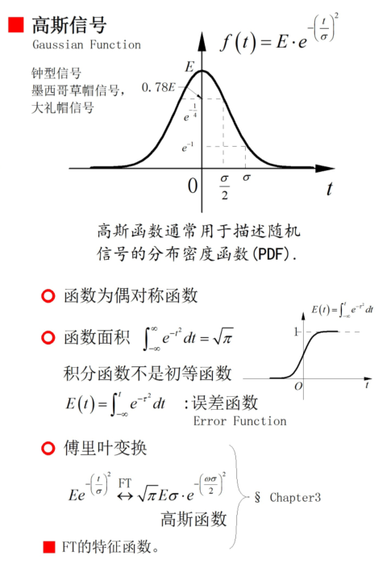
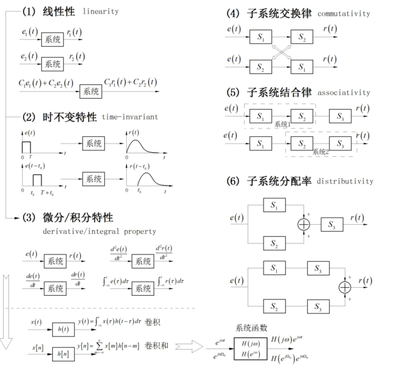

# 信号与系统基本概念

## 信号的表征：

* 略

## 信号的分类：

* 确定性信号和随机信号
* 时间信号：连续、离散
* 周期、非周期
* 能量无限、有限

周期信号复合：

* 两个周期信号想要加起来还是周期信号，需要周期的比值为有理数

## 奇异函数：

* 函数本身或其导数存在不连续点的信号
* 单位斜边信号
* 单位阶跃信号 u(t)
  * 可以用来构造窗口函数
  * 卷积上有一些性质
  * 傅里叶变换上有一些性质

* 单位冲激信号$\delta(t)$
  * 偶对称
  * 尺度特性
  * 
  
* 单位冲激偶信号$\delta'(t)$

## 重要偶对称信号：

## 信号的自变量变换：

* 平移、尺度、反褶

## 信号的分解：

* 直流分量和交流分量
* 奇分量和偶分量
* 实分量和虚分量

## 系统分类

* 连续时间系统，离散时间系统
* 即时系统(无记忆)，动态系统(记忆)
  * 即时：只与当前输入有关
* 线性，非线性系统
  * 叠加性、齐次性

* 时变，时不变系统
  * 输入有时移时，输出也产生同样的时移
  * 检验方法：令$x_2(t)=x_1(t-t_0)$代入系统检验输出$y_2(t)=y_1(t-t_0)$是否成立
* 可逆，不可逆系统
  * 可逆：输入和输出一一对应，就是根据输出能反解出唯一输入
* 因果，非因果系统
  * 因果：只与当前输入及以前输入有关
* 稳定，非稳定系统
  * 稳定：输入有界则输出也有界

线性时不变系统LTI

