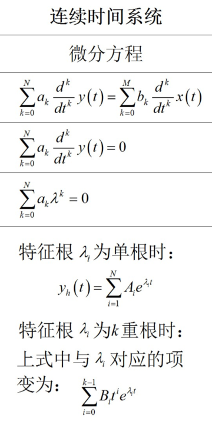
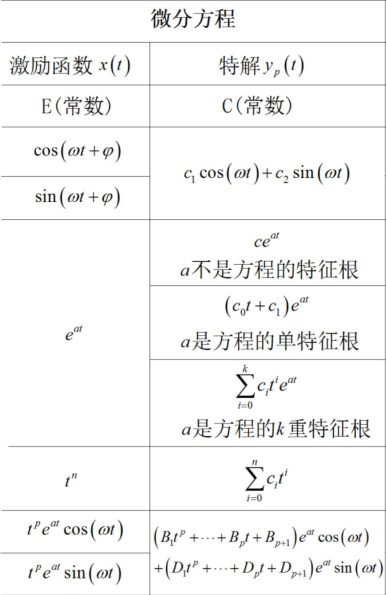
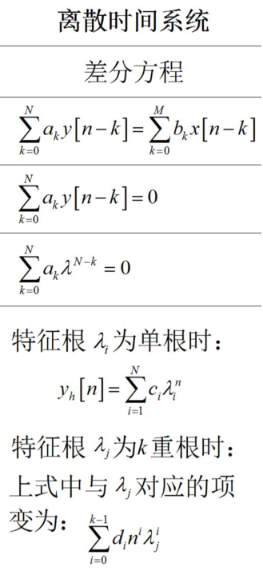
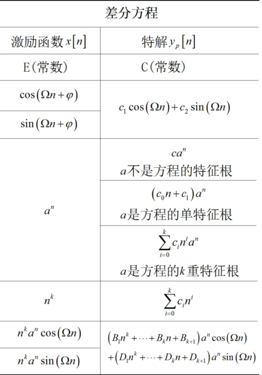
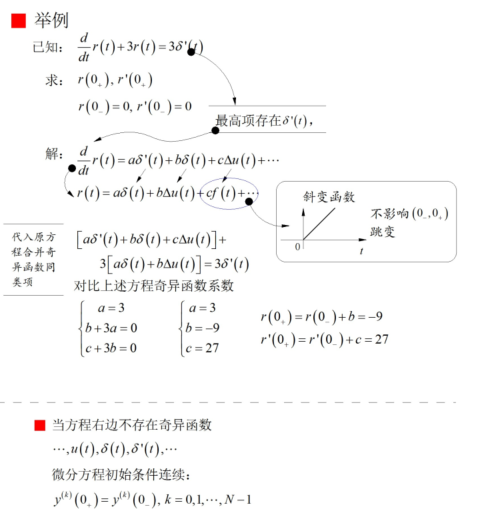
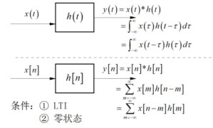
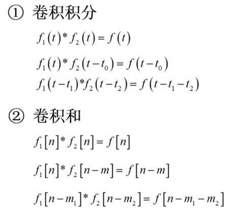
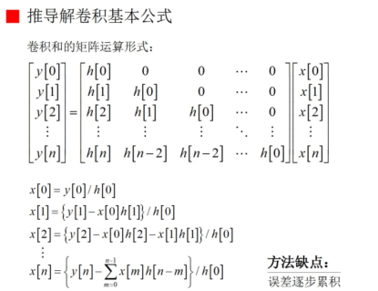

# 信号的时域分析

## 1. 求解微分差分方程

### 微分方程

* 求齐次解
  * 
* 求特解
  * 背特解形式
  * 

* 齐次解加特解得到完全解
* 利用**初始条件**求解待定系数

### 差分方程

* 求齐次解
  * 
  * 注意相当于y[n-1]比y[n]的指数次数低
  * 注意齐次解形式上和微分方程不同
* 求特解
  * 背特解形式
  * 

* 齐次解加特解得到完全解
* 利用**初始条件**求解待定系数

### 奇异函数匹配法

用途：输入为阶跃函数、脉冲函数或者其若干阶导数时，求y在该激励下的跳变量

微分方程初始条件连续的充要条件是微分方程右端不包含单位脉冲或者他的导数项。

怎么实现看下面例题就够了：

### 零状态响应和零输入响应

解释：

* 零状态响应$y_{zs}$：系统在起始条件为零的情况下的系统有输入信号所产生的响应。

  * 什么叫起始条件为0呢：

    就是在0_时刻的若干阶导数或者若干阶差分都为0.（见红皮64页）

    但是在$0_+$时刻的值和导数可以不为0

  * 

* 零输入响应$y_{zi}$：系统在没有外部输入信号的情况下，由内部起始条件所产生的响应。

  * 没有外部信号：类似于齐次解，而且在0时刻y的若干阶导数都连续
  * 注意如果是离散时间，则初始条件为y[0]以前的值（-1、-2等）。

### 单位脉冲响应和单位阶跃响应

先正常的解方程

利用奇异函数匹配求出0+的状态

代入解中求出待定系数

注意：最后结果要乘上u(t)表示在t>0时有效

## 2. 卷积

定义

用途：

* 求解零状态响应
* 输入和单位脉冲响应卷积

性质：

交换律

分配率

结合律

微分积分性质

时移性质

与奇异函数卷积

在卷积运算时多用这些性质可以极大地简化计算

​                         

解卷积：

