# 傅里叶变换

## 0 预备知识

### 0.1 正交函数

正交：向量相互垂直，即乘积为0

正交函数：内积为0，内积定义为

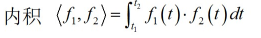

正交函数集合：集合里面的函数都正交

完备正交函数集合：任意函数能分解为该集合中函数的线性组合

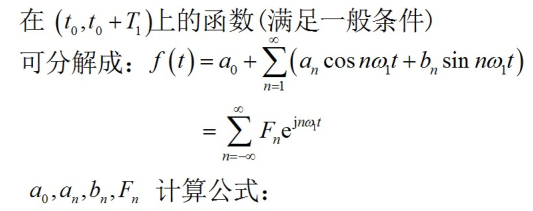

## 1 周期信号傅里叶级数

### 1.1 三角函数形式和复指数形式的傅里叶级数

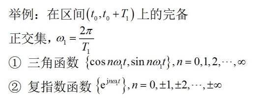

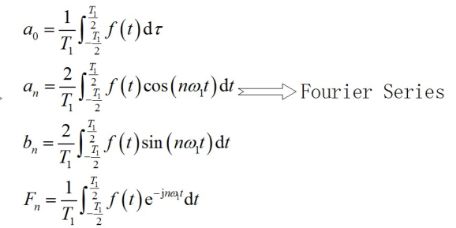

此外，为了简化表达形式，还引入了三角傅里叶级数的第二种形式：

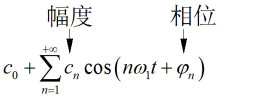

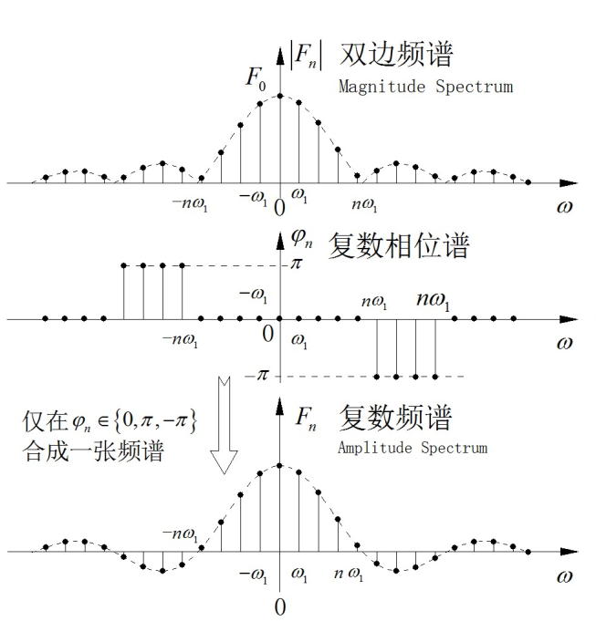

### 1.2 典型波形的傅里叶级数

补充：

sinc函数，又称辛格函数，用sinc(x)表示。（sinc函数与Sa函数的数学表达形式相同，Sa函数称为采样函数，或抽样函数，用Sa(x)表示，Sa函数词条请看[抽样信号](https://baike.baidu.com/item/抽样信号/1622047)）有两个定义，有时区分为[归一化](https://baike.baidu.com/item/归一化/2215161)sinc（分母有个\pi）函数和非归一化的sinc函数。

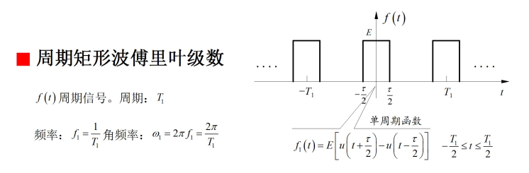

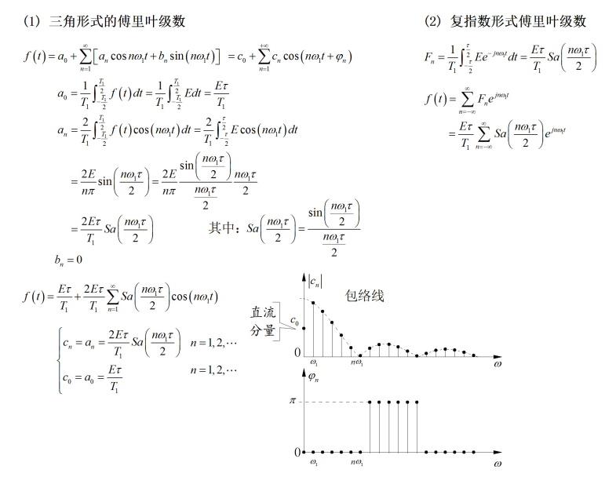

### 1.3 奇谐函数的傅里叶级数

奇谐函数:平移半个周期后与原函数关于水平轴对称

波形特点：偶数次n的an和bn为0

## 3 傅里叶变换

### 定义

周期无限增大时，周期信号变为非周期

重点：指数形式的傅里叶级数表达式

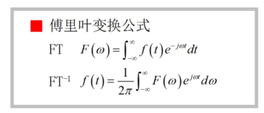

性质：

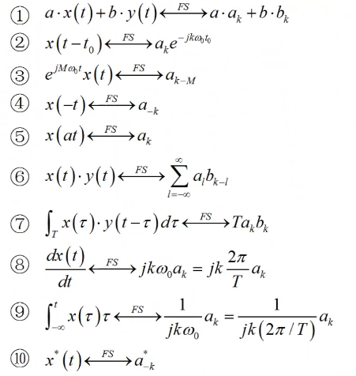

### 变换存在条件

### 性质

对称性

一个信号连做两次傅里叶变换回到他本身的形式

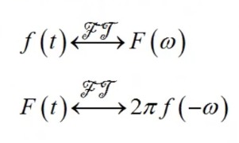

特殊：做一次回到本身

线性性

奇偶虚实性

* f为实偶函数，F必为实偶函数

* f为实奇函数，F必为实奇函数

尺度变换特性

时移特性

频移特性

微分特性：

微分会引起另一边用自变量加权

已知信号乘以自变量

用于简化傅里叶变换

建立系统函数的概念

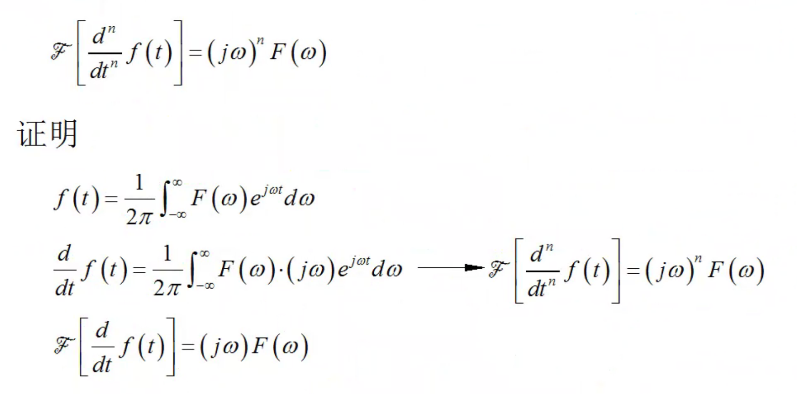

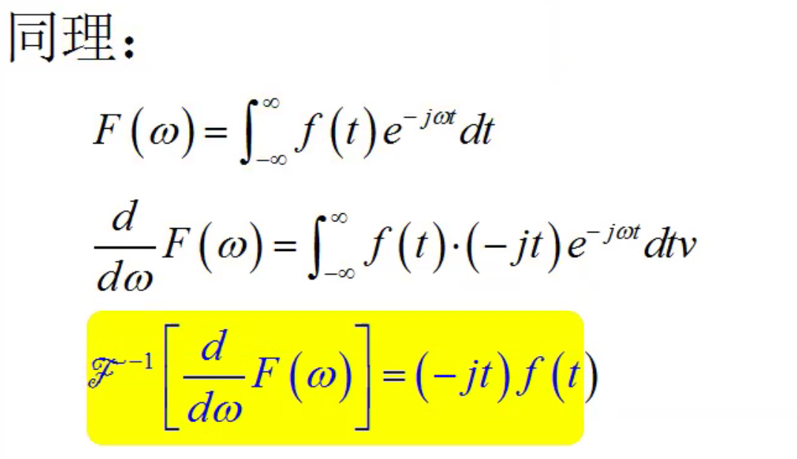

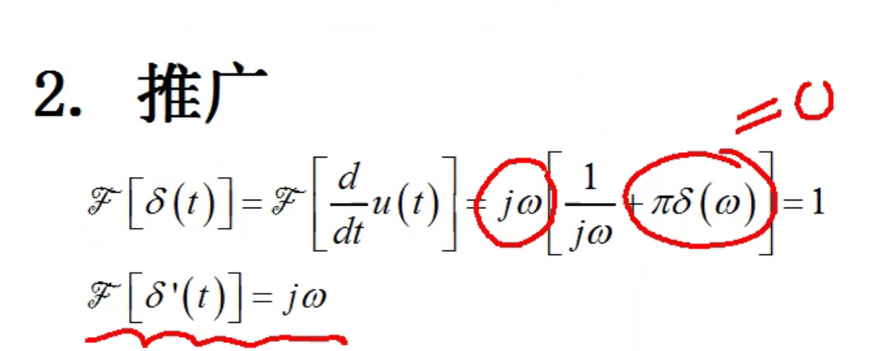

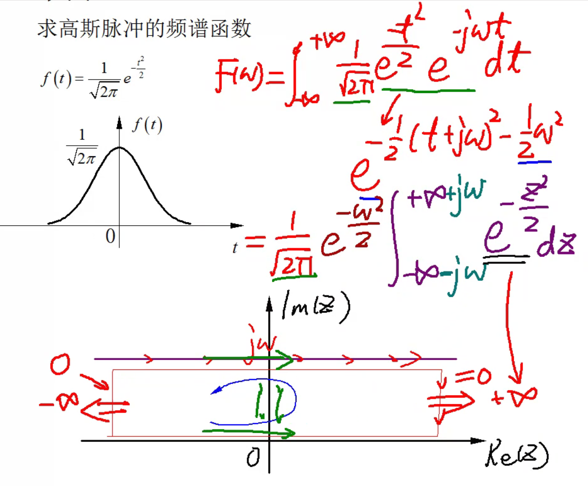

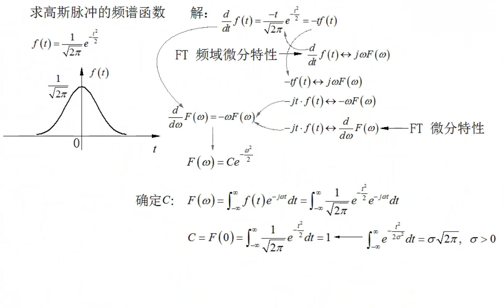

积分特性

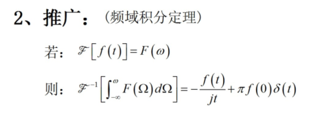

有限长偶信号的导数积分为0

卷积特性

### 常见变换

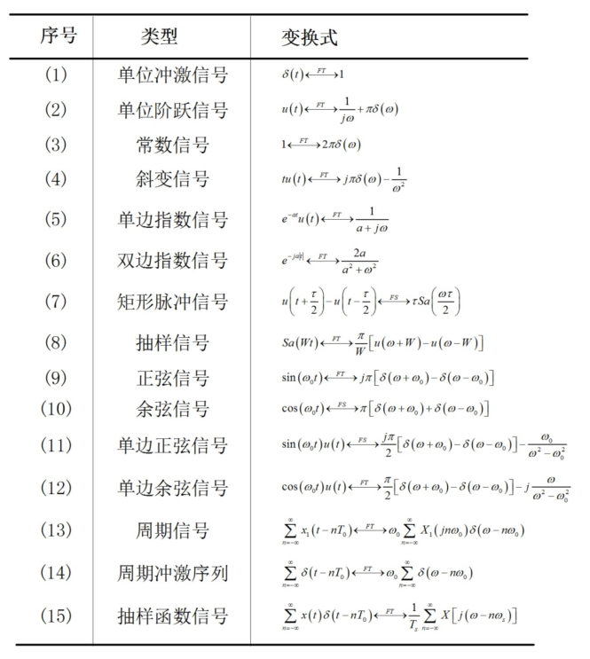

### 卷积定理

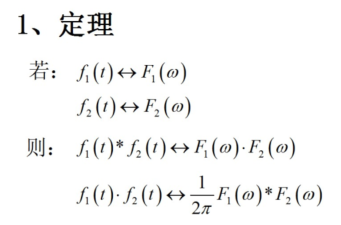

尺度变换不满足时不变

### 周期信号傅里叶变换

思路：

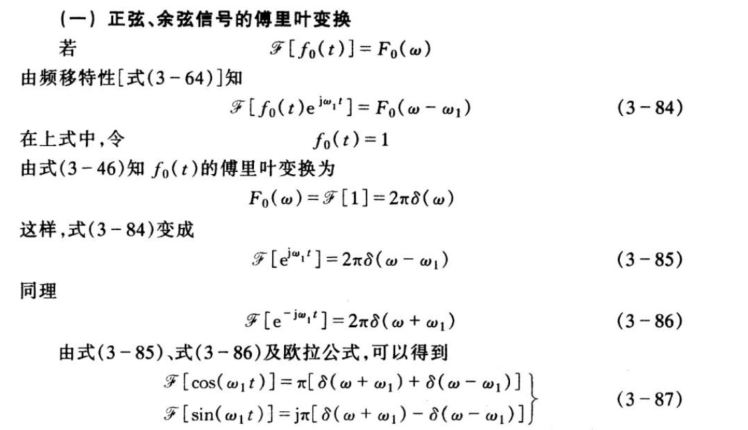

* 首先算出正余弦函数的傅里叶变换
* 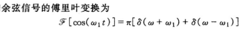
* 然后将一般的周期函数进行傅里叶级数分解，成为若干正余弦函数
* 由傅里叶级数可加性，得到等于一系列正余弦的傅里叶变换求和

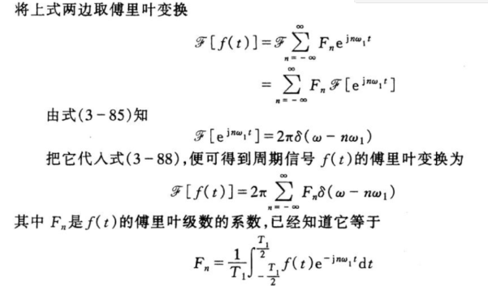

## 4. 傅里叶变换全性质总结

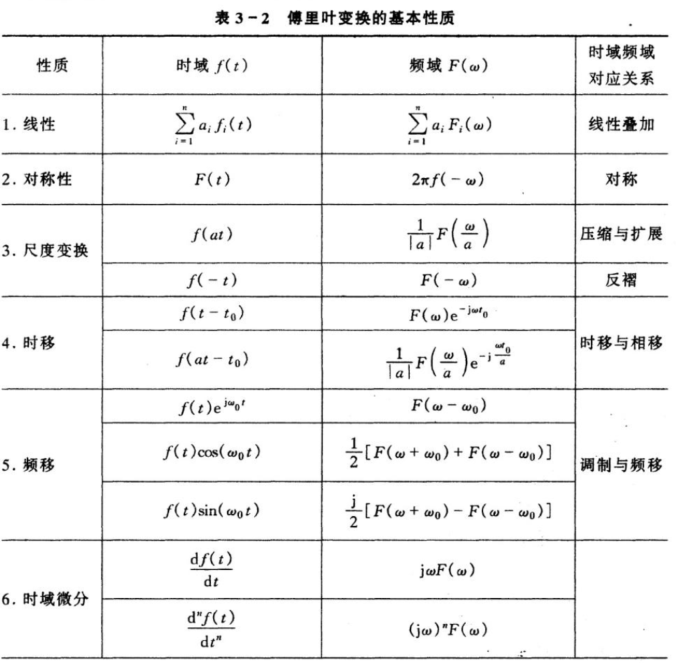

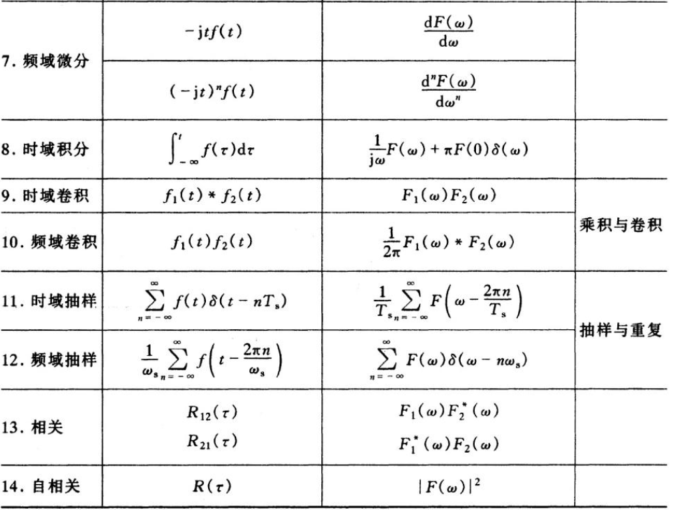

期中考试：

45分钟，手机上，60或80个选择题，基本概念选择题，比重0.2

期中之前的内容在期末还要考。

