# 频谱分析技术应用

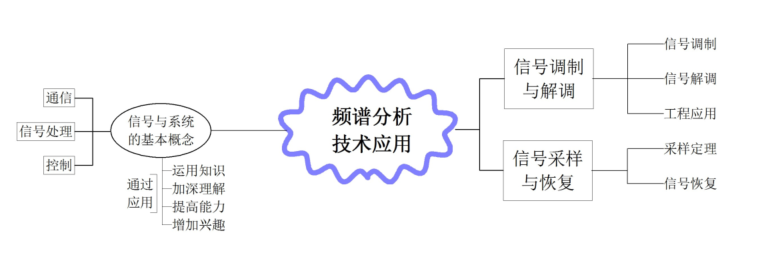

## 1.信号调制

将低频信号的信息放到一个高频信号之中

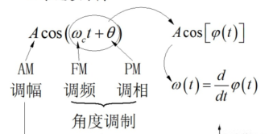

### 幅度调制

幅度调制：改变载波幅度

角度调制：改变载波频率或相位

#### 正弦调制

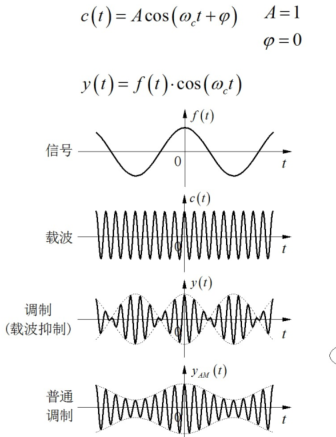

傅里叶变换关系为：

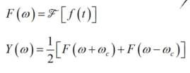

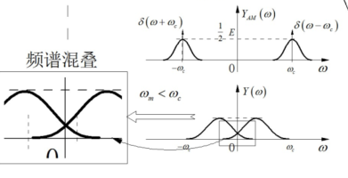

#### 复指数调制

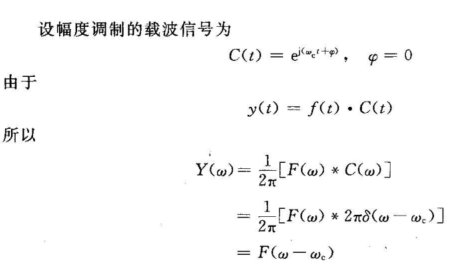

？？？ct的傅里叶变换是这个吗

#### 单边带调制

希尔伯特变换

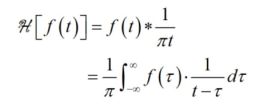

希尔伯特变换实际上是使信号相位之后pi/2的全通移相网络。

## 2.信号解调

正弦调幅的解调

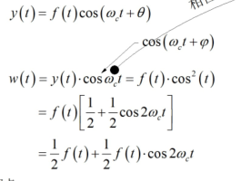

乘上cos在频域上看是平移。

同步解调：

* 乘上同频同相位的信号来解调

非同步解调（包络线解调）：

* 整流
* 要保证信号为正
* 其他的卓晴都没讲清楚

应用：

* 调制放大
* OCT/引力波
* 信道复用
  * 频分
  * 时分
  * 码分

## 3.信号的采集与恢复

时域理想采样：

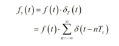

参考紫书P152的证明，后面那个冲激函数求和的傅里叶变换为： 

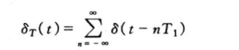

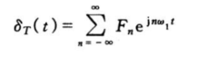

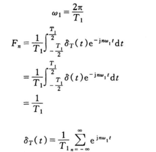

然后根据一般周期信号的傅里叶变换：

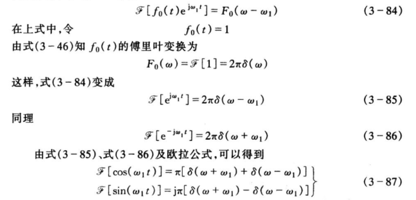

于是：

### 时域采样

根据上面结论，相当于将原来的频谱进行一个搬移

时域离散化等效于频域周期化

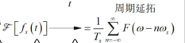

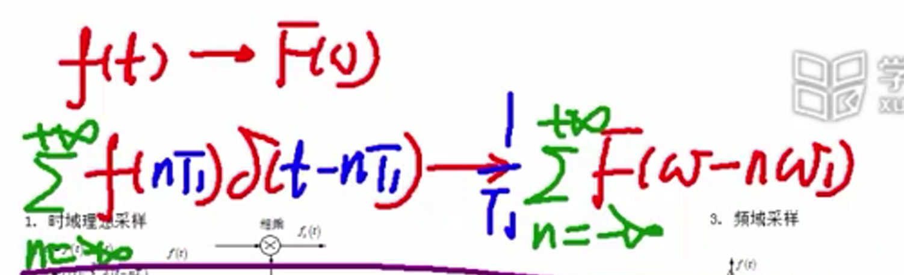

### 频域采样

频谱采样等效于时域周期化

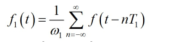

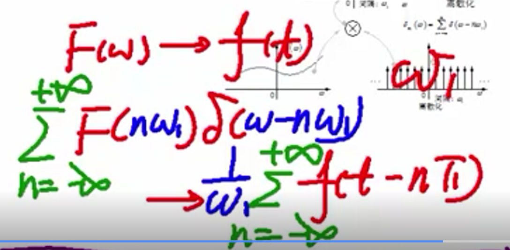

### 周期矩形波采样

又叫自然采样，用周期矩形波进行采样

周期矩形波傅里叶变换：

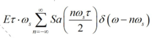

和信号卷积：

### 采样定理

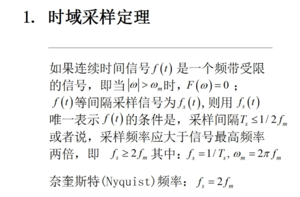

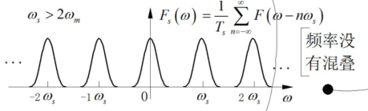

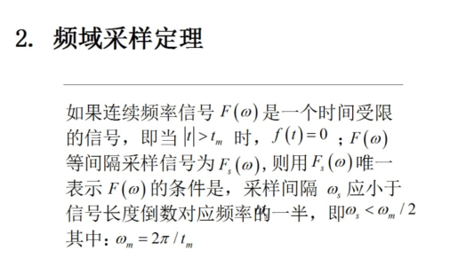
