# 程序的机器表示

## 1.操作数和结果的主要来源

### 1.1 寄存器

**寄存器**（Register）是[中央处理器](https://zh.wikipedia.org/wiki/中央處理器)内用来暂存指令、[数据](https://zh.wikipedia.org/wiki/數據)和[地址](https://zh.wikipedia.org/wiki/内存地址)的[电脑存储器](https://zh.wikipedia.org/wiki/電腦記憶體)。寄存器的存贮容量有限，读写速度非常快。在[计算机体系结构](https://zh.wikipedia.org/wiki/電腦架構)里，寄存器存储在已知时间点所作计算的中间结果，通过快速地访问数据来加速[计算机程序](https://zh.wikipedia.org/wiki/電腦程式)的执行。

8086架构

IA32架构

IA64架构

4个数据寄存器(EAX、EBX、ECX、EDX)
2个变址和指针寄存器(ESI、EDI)
2个指针寄存器(ESP、EBP)
6个段寄存器(ES、CS、SS、DS、FS、GS)
1个指令指针寄存器(EIP)
1个标志寄存器(EFL)

参数寄存器（按顺序）：%rdi,%rsi,%rdx,%rcx,%r8,%r9【只有六个，超出则只能使用栈帧进行传参】

### 1.2 立即数

立即数就是直接写在指令里的数

### 1.3 内存

rbp：栈底指针

rsp：栈顶指针

RIP是什么？

*  执行指针寄存器，指向即将执行的指令，内容会变

同一个全局变量为什么有不同的相对地址？ 

* 存放于指令代码之后，可以从指令位置算出其地址

同一个全局变量的绝对地址变不变？ 

* 不变，只有一个，但相对于RIP的偏移是变的  

常量是否占内存：

* 全局的常量，作为立即数不占内存，除非访问其地址
* 写在函数内的常量，要占内存

## 2.数据传送

寻址的一个关键点是判断数据类型，从而才能取出对应的数据。CPU关心的是数据的长度，所以操作不同类型的数据，只需在指令中写上其对应的长度。

### 2.1 mov 指令

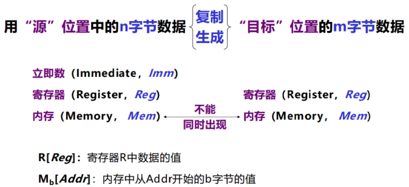

* intel把目标放在指令的前面，ATT把目标放在指令的后面

#### 寻址方式

* 其中R[Reg]表示寄存器Reg中存储的值，M[Addr]表示内存中从Addr开始若干字节的值

也就是说：

* $+立即数，返回的是立即数
* 只有立即数，在intel返回的是立即数，在AT&T返回的是立即数对应地址存储的值

* 遇到中括号和小括号，就是读寄存器里存的数算出来的地址对应的空间里面存的数

#### 一般传送

即源和目标字节数一致

当目标是寄存器时服从以下规律：

* 如操作数长度为1、2字节，则寄存器高字节不变  
* 如操作数长度为4字节，则寄存器高字节置0  

#### 拓展传送

源和目标的字节数不一样，而且源的长度小

1、认为目标是有符号数，以源操作数符号位扩展目标高字节。

* Intel格式执行movsx , s代表signed，x代表extend

* AT&T格式执行movs??  , s代表signed，??后缀分别代表源和目标字节数，源长度后缀在前

2、认为目标是无符号数，以0扩展目标高字节。

* Intel格式执行movzx , z代表zero，x代表extend

* AT&T格式执行movz??  , z代表zore，??后缀分别代表源和目标字节数，源长度后缀在前  

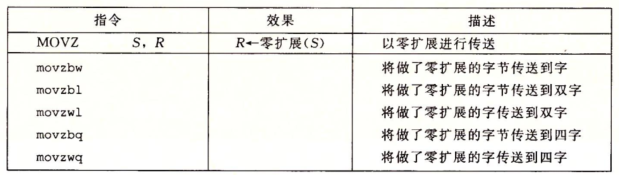

注意没有movzlq，因为操作数长度为4字节，则寄存器高字节默认置0  

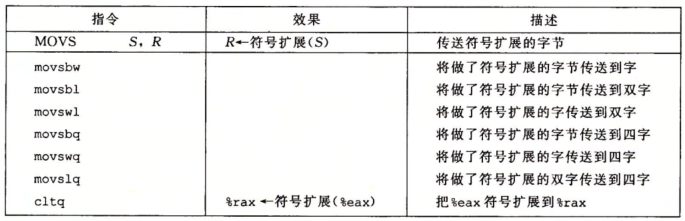

#### 浮点传送

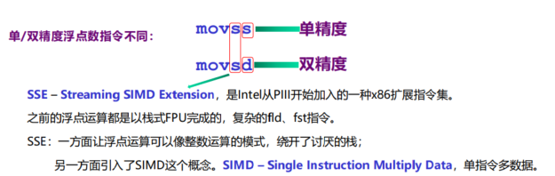

除了我们已经讨论过的寄存器，现代处理器还有一些扩展。这些扩展体现在电路上，指令集上，有时候也会扩展一些很有用的寄存器。比较著名的扩展叫作 SSE (Streaming SIMD Extensions)，该扩展加入了新的 xmm 寄存器集合：xmm0，xmm1，...，xmm15。这些寄存器为 128 位宽，常用于两种任务：

- 浮点数运算；以及
- SIMD 指令集(这种指令一条指令可以操作多条数据)

常用的 mov 指令没有办法操作 xmm 寄存器。movq 指令可以代替用来拷贝 xmm 寄存器的低位(128 位中的低 64 位)，操作数的其中一个可以也是 xmm 寄存器，或者通用寄存器，或者内存(也得是 64 位)。

为了填满 xmm 寄存器，你有两个选择：movdqa 和 movdqu。前者可以解释为“ move aligned double quad word”，移动两个对齐的 qword。后者是未对齐的版本。

大多数 SSE 指令都需要内存操作数适当地进行对齐。上面说到的未对齐版本的指令和对齐版本的指令在助记符上就有差别，而且因为内存未对齐的关系，性能也会受影响。由于 SSE 指令经常被用在性能敏感的场合，所以始终使用操作数内存对齐版本的指令是明智之举。

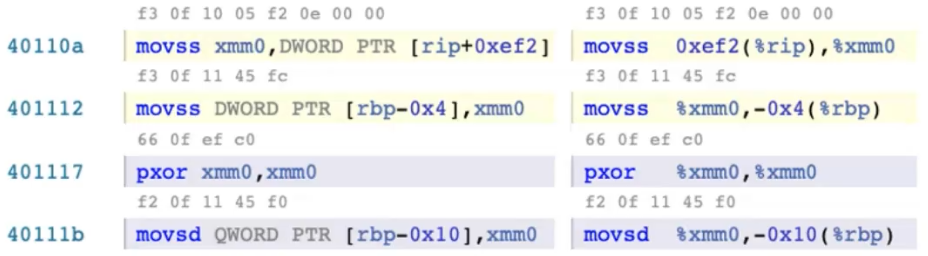

[rip+xxx]表示是全局的量

#### 条件传送

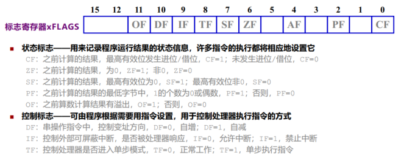

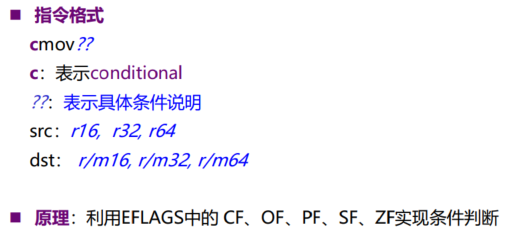

在处理无符号数时：

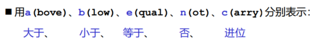

在处理有符号数时：

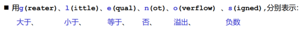

意义：条件传送比分支结构效率更好，因为不涉及指令跳转，不使用CPU分支预测  

#### 特例

1）mov dst, Imm 和 movq $Imm, dst（常规mov只能移32位）

* Imm只能是32bits，将Imm以符号位扩展到64bits  

2）movabs dst, Imm 和 movabsq $Imm, dst（movabs叫绝对传送，将全部的数值传进去）

* Imm只能是64bits ， dst只能是寄存器  

3）

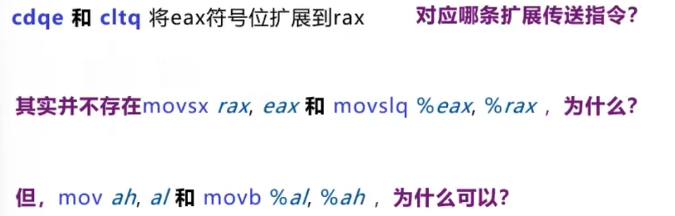

### 2.2 有限栈空间

### 2.3 数据访问

一维数组： 

类的成员函数：

其本质是先传一个this指针到rdi去。

32位机器开始，会默认把成员放在四的整数倍的内存上

- `.LCn`：是 `Local Constant` 的缩写。

## 3. 算数逻辑运算

### 3.1 取地址运算

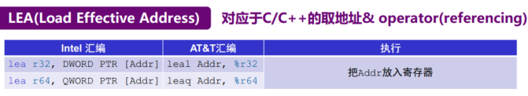

RDS:段寄存器：DS×4＋给定地址->1M

给定地址：EA，但现在意义不明确了，就认为是个普通地址即可

movq (%rbx), %rax  

leaq (%rbx), %rax   :不再是从rbx存储的地址处取值，而是直接传存储的地址，

lea c,ebx  :此时是取c的地址放入ebx中

### 3.2 加减法

add：加

sub：减

neg：取负

inc：自增

dec：自减

注意：inc和dec不产生进位

adc：带进位的加法

sbb：带借位的减法

### 3.3 乘除法

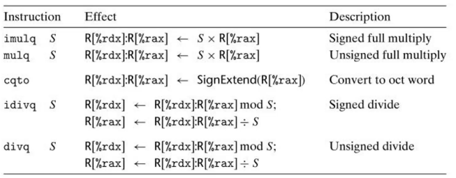

64位×64位，结果是128位（高64位在rdx，低64位在rax）
128位（高64位在rdx，低64位在rax）÷64位，结果是64位  

对于乘除法来讲，操作数不可以是立即数。

且只有S可能来自内存，其他来自寄存器。 

cqo和cqto：把rax高位扩展到rdx

### 3.4 位移

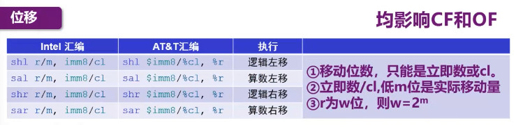

CF:进位

OF:溢出

逻辑移：补位填0

算数移：补位填相邻位

移动位数：要么是8位立即数，要么来自cl

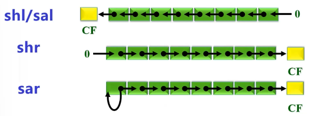

### 3.5 逻辑运算

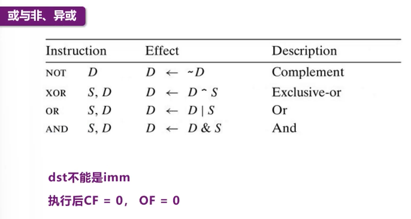

## 4.控制

### 4.1 条件码

处理器状态：

寄存器

栈的位置

当前程序控制点的位置rip

标志位（条件码）：（CF进位,ZF零,SF符号,OF溢出）

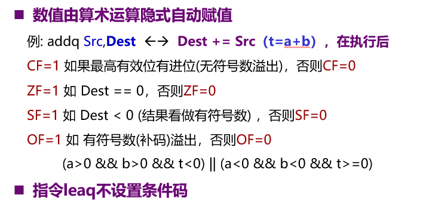

比较和测试：

cmp和test指令就是根据两个输入值改变条件码而不做其它改变。

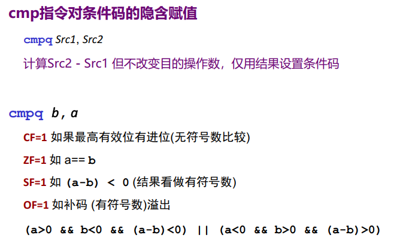

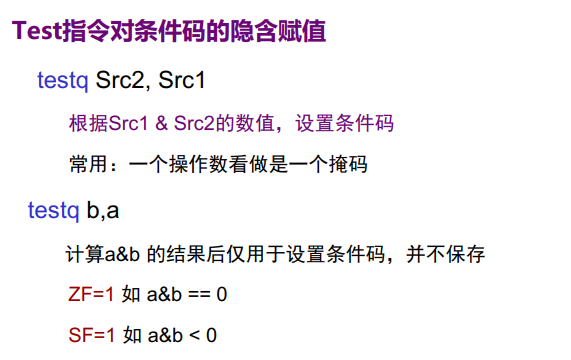

条件码常见使用方法有三种：

1.根据条件码的组合将一个字节设置为0或者1（set）

2.条件跳转到程序的某个其他部分

3.有条件的传送数据

访问条件码：

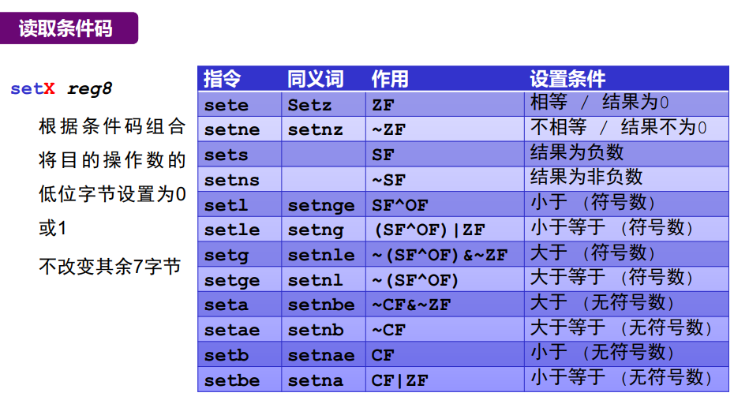

### 4.2 条件分支

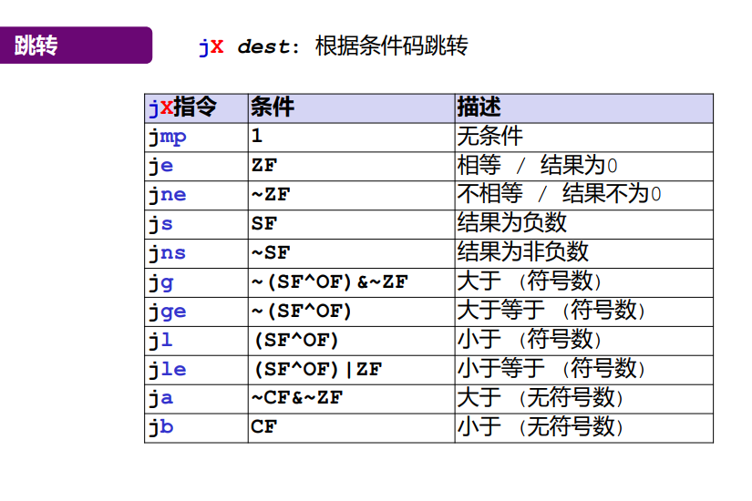

程序计数器的值是跳转到指令后面的那条指令的地址，而不是跳转到指令本身的地址

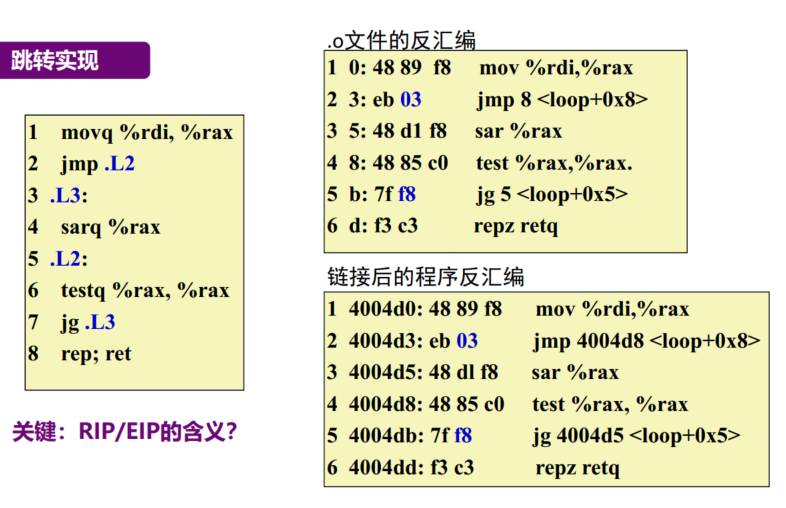

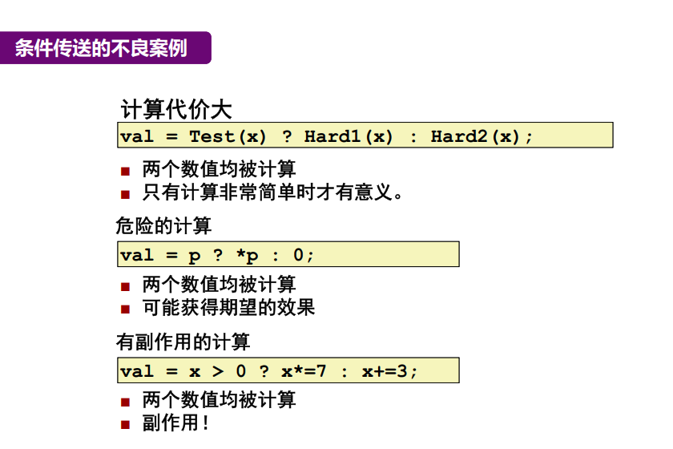

## 5.复合数据类型

### 5.1 一维数组

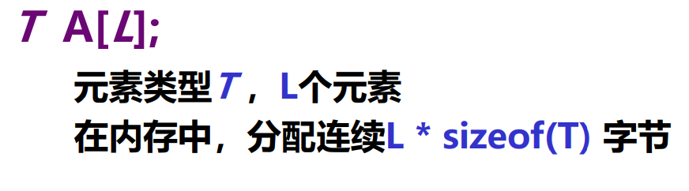

typedef   原类型前缀   新类型   原类型后缀

### 5.2 多维数组

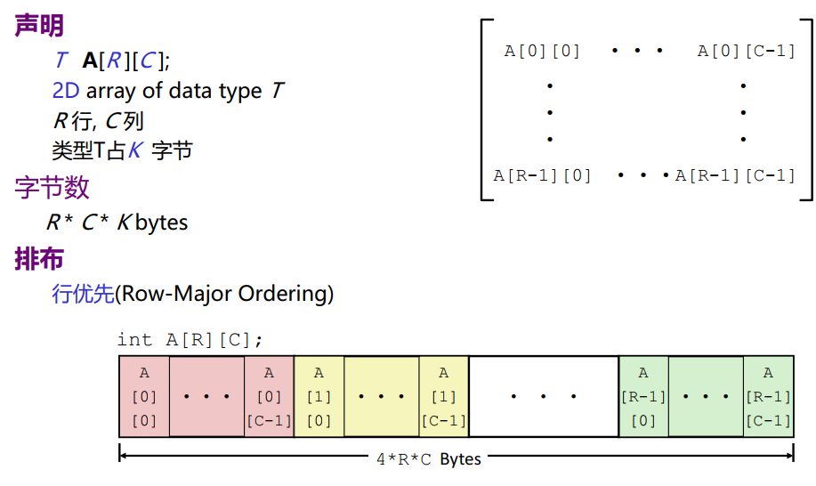

### 5.3 结构体和类

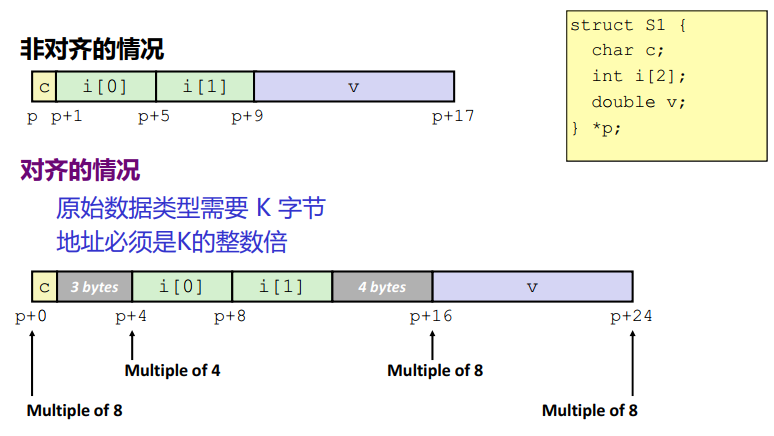

## 6.过程

* C/C++只有函数
  有返回值的 叫 function
  无返回值的也叫 function（返回值类型void表示：没有返回值）

* Pascal语言则不同
  有返回值的 叫 function
  无返回值的也叫 procedure（过程）

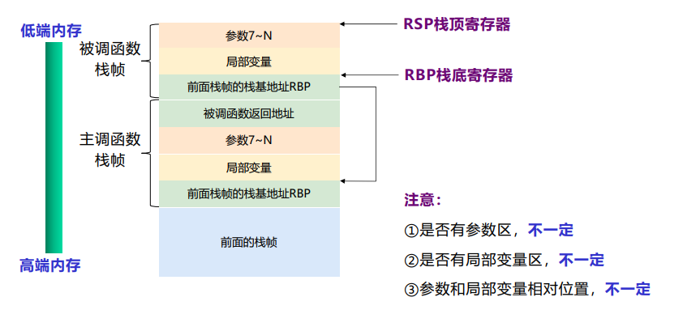

### 6.2 控制传递

### 6.3 数据传递

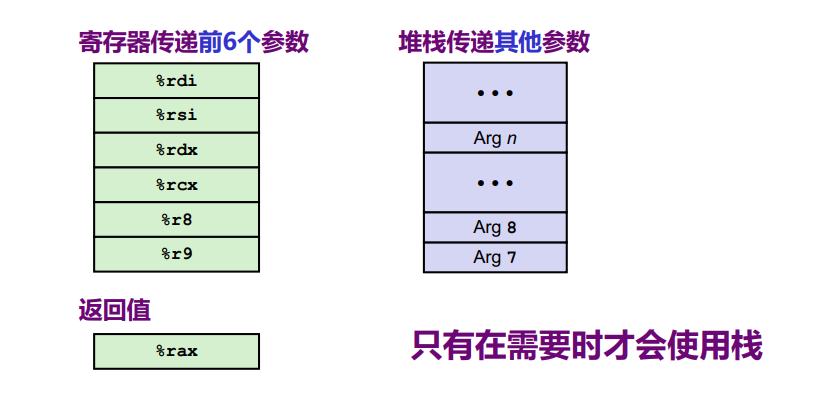

### 6.4 递归

